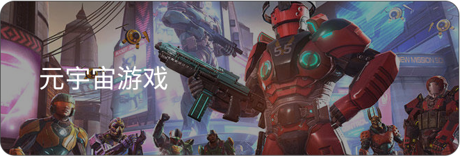
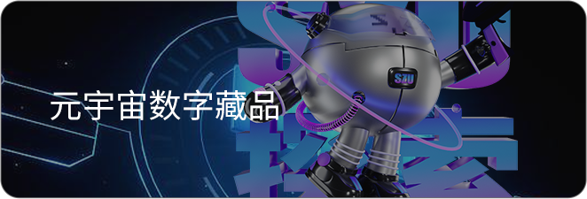
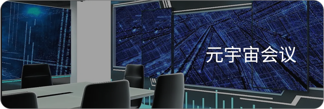

# 📖 MetaverseKIA白皮书

白皮书内容正在制定中，请稍后进行查看。


[qian-yan.md](qian-yan.md)



[xiang-mu-bei-jing](xiang-mu-bei-jing/)



[xiang-mu-jie-shao](xiang-mu-jie-shao/)



[tuan-dui-jie-shao.md](tuan-dui-jie-shao.md)



[fa-hang-ji-hua](fa-hang-ji-hua/)


<figure><figcaption></figcaption></figure>

 

<figure><figcaption></figcaption></figure>

 

<figure><figcaption></figcaption></figure>

 

<figure><figcaption></figcaption></figure>

 

<figure><figcaption></figcaption></figure>

 

<figure><figcaption></figcaption></figure>

 

<figure><figcaption></figcaption></figure>

 

<figure><figcaption></figcaption></figure>

